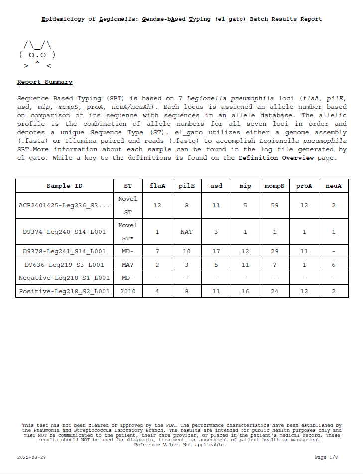

# Reporting Module  

We provide a script that generates a PDF report for each el_gato run using the report.json file located in the output folder for each sample. You can generate reports for one or more samples, including assembly, and review the results.

* [Dependencies](#dependencies)
* [Usage](#usage)
  * [Quickstart](#quickstart)
  * [All available arguments](#all-available-arguments)
*[Report summary](#report-summary-overview)
  * [Example image of pdf report](#example-image-of-pdf-report)

## Dependencies
  * [fpdf2](https://github.com/py-pdf/fpdf2)

## Usage

### Quickstart
```
elgato_report.py -i <path/to/report1.json> [<path/to/report2.json> ...] -o <path/to/output/report.pdf>
```

### All available arguments
Usage information printed when running elgato_report.py with `-h` or `--help`

```
options:
  -h, --help            show this help message and exit
  -i, --input_jsons     path to one or more report.json files
  -o, --out_report      desired output pdf file path
  -s, --shorten_names   shorten long sample and contig names to prevent line wrapping
  -n, --no_header       Do not include the header in the report
  -d,  --disclaimer     Include disclaimer in footer
  --custom_header       Provide a custom header as a string in your command
  --header_file         Provide a custom header in a text file
```

## Report summary overview
A description of the sections that are generated when using the el_gato reporting module. In teh example image below, the report summary page is shonw. 
* Report Summary page: Summary of el_gato and complete ST profile for each sample included in the report.  

* Definitions Overview page: ST definitions key and evidence for support of *mompS* allele call key.

* Paired-end reads: Locus coverage information and *mompS* primer information parsed by each sample.  

* Assembly: BLAST hit length and sequence identity thresholds and locus location information parsed by each sample.  

## Example image of pdf report

<p align="center">
  
</p>

**Figure 1: Example report** -This report was generated using the elgato_report.py script and only shows the first summary page of the report. 

